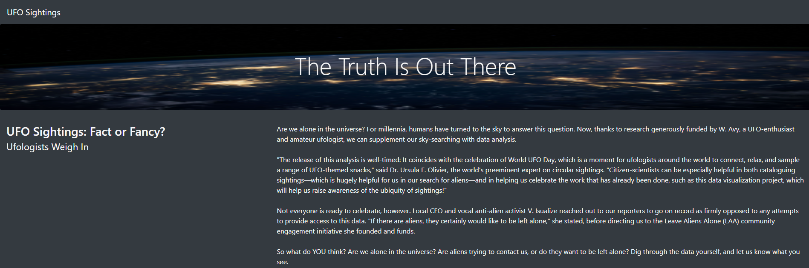
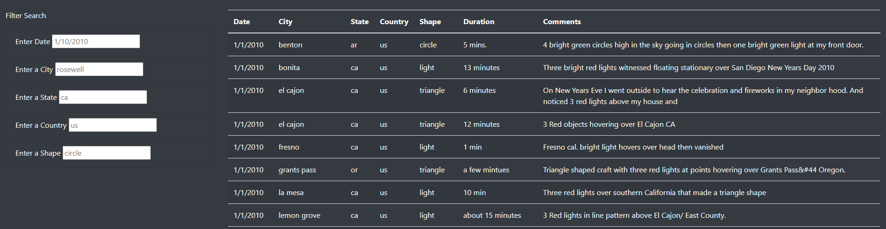
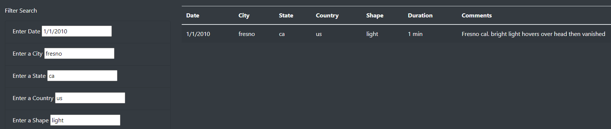
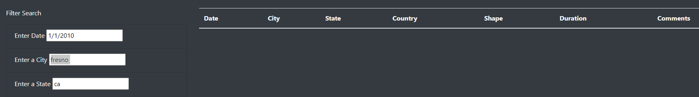

# UFOs Sightings!

## Project Overview
Dana wants to provide a more in-depth analysis of UFO sightings on her newly built webpage by allowing users to filter for multiple criteria at the same time. The users will be able to enter a date, city, state, country and/or shape to filter the sighting to their needs.

## Results

### The Truth is Out There! The top of the page displays a title section with a background image and the text is updated to improve visability with white text.

### Filters and the table of the results at first visit of the page before filters are used.

### Searching with the Filters
When the filters are used it is easy for users, with the right information, the pinpoint an entry in the table with the filters. A user can fill out the date, city, state, country, and/or shape in order to yield results on the table for UFO Sightings.

## Summary
As shown above these filters are helpful to narrow down the table's results; however, there are some drawbacks when using these filters.

### Problem #1: Unwanted Spaces Used in Filter Value
As shown in the picture below, when a space after a filter value isused the table shows no results as it is just looking for the filter value without the space at the end.

Recommended Solution: Additional filter functions should be worked into the filter process to take into account these easy user errors and be able to still display the wanted information.

### Problem #2: Dates That Are Not Exact
Say a user wants to see ALL the sightings from any given month and year or just a full year. When a day or month is not inserted in the filter field, no results are displayed in the table.

Recommended Soultion: Additional filter functions for the date should be added when only a year or a month with a year can yield the results of ALL the sightings for the month or that year specified.
